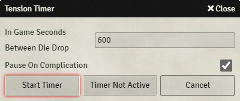
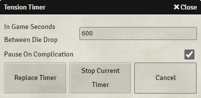

## Hook calls

#### On Pool Roll

Hooks.call("tension-poolRolled", dicerolled, diceleftinpool,complicationoccured);

- dicerolled (int) - The number of dice rolled
- diceleftinpool (int) - The number of dice left in the pool after the roll is complete
- complicationoccured (bool) - whether a complication should occur

#### On Change in Dice in Pool

Hooks.call("tension-poolChange", diceinpool);

- diceinpool (int) - The dice in the pool after dice added or removed

## API

The API is called via game.tension; for example

    game.tension.adddie()


#### Adding and removing die

`game.tension.adddie()` (async) takes no args and adds 1 die to the pool

`game.tension.removedie()` (async) takes no args and removes 1 die from the pool

`game.tension.emptypool()` (async) takes no args and removes all dice from the pool

#### Rolling the pool

All pool rolls return a Promise<boolean> that resolves true if a complication was rolled, false if not.

`game.tension.rollcurrentpool()` (async) takes no args and rolls the pool with the current number of dice

`game.tension.rollfullpool()` (async) takes no args and rolls the pool after filling it with dice

`game.tension.rollcustompool(dice,message,dicesize)` (async) takes 3 args and rolls the pool meeting the args

```/**
     * Rolls a custom dice pool
     *
     * @returns {Promise<boolean>} where resolves true if a complication was rolled, false if not.
     * @param dice (int) - the number of dice to be rolled
     * @param message (str) - the message to be displayed in the notification/chat message
     * @param dicesize (str, optional) - sets the size of dice to be used ("dt6" for Tension Dice's ! dice). Default: current dice size in settings
     */
```

For example `game.tension.rollcustompool(10,"Custom Pool Rolling","d20")` will roll 10d20 and will display the message "Tension Pool | Custom Pool Rolling"

#### Tension Timer

`game.tension.TensionTimerConfig()` (async)  takes no args and simply loads the Tension Timer dialog.

Tension Timer requires [Simple Calendar by vigoren](https://github.com/vigoren/foundryvtt-simple-calendar#installing-the-module); Simple Calendar is not a dependency so needs to be installed and activated separately.  
Setting a Tension Timer will lead to a die being dropped in regular intervals based on the in game clock.

To set a timer open the timer configure using the scene controls.  
Pick the interval you wish to use in _in game_ seconds (default: 600).  
Hit start timer and the Tension Timer will automatically drop dice as appropriate.
The simple calendar must be running for dice to drop.



To replace or stop a timer, open the timer configure using the scene controls and choose the appropriate option.



There are known issues with the Tension Timer that will not be fixed.